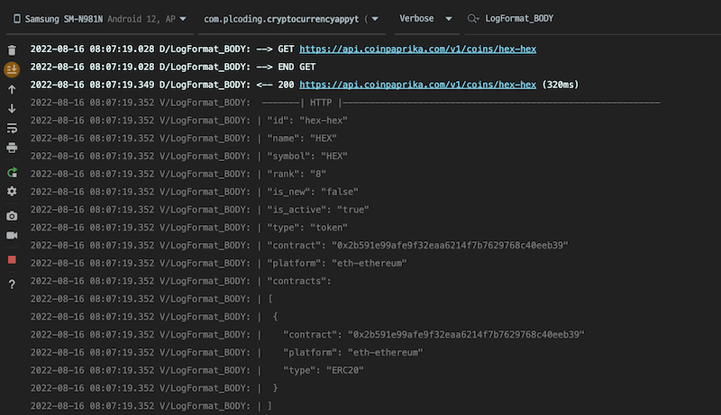
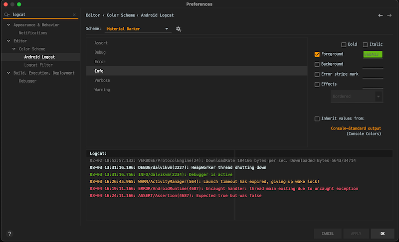
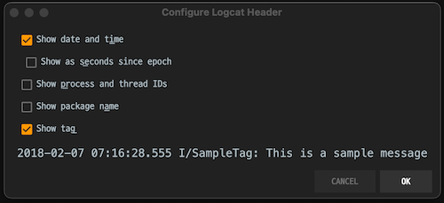

## How to use

#### Module level build.gradle
```groovy
dependencies {
    implementation 'io.github.mrjino:AndroidUtils:1.1.5'
}
```
#### If you want to see http response log (using retrofit interceptor)
```kotlin
import noh.jinil.android.log.LogFormat

val loggingInterceptor = HttpLoggingInterceptor { message ->
    LogFormat.httpResponse(message)
}.apply {
    setLevel(HttpLoggingInterceptor.Level.BODY)
}

val httpClient = OkHttpClient.Builder()
    .addInterceptor(loggingInterceptor)
    .build()

Retrofit.Builder()
    .baseUrl(baseURL)
    .client(httpClient)
    .build()
    .create(YourApi::class.java)
```
#### you can see beautiful log in your Android Studio logcat like below

TAG for filtering
* LogFormat_BODY - HTTP Request, Response, Body
* LogFormat_HEAD - HTTP Header
* LogFormat_MAIN - General Log

#### If you want to see logs in debug mode only
```kotlin
import noh.jinil.android.log.LogFormat

class YourApplication : Application() {
    override fun onCreate() {
        super.onCreate()
        LogFormat.initialize(debuggable = BuildConfig.DEBUG)
    }
}
```

## For better usage

#### Additional setting is recommend for better looking log
```Shell
# log level color settings
0xFF5370 (Error)
0xF3B157 (Warning)
0x66BA13 (Info)
0xEEFFFF (Debug)
0x7A7A7A (Verbose)
```
Preferences -> Editor -> Color Scheme -> Android Logcat



uncheck 'show process and thread IDs', 'show package name' in Logcat Header menu



## License

```
Copyright 2022 MrJino

Licensed under the Apache License, Version 2.0 (the "License");
you may not use this file except in compliance with the License.
You may obtain a copy of the License at

   http://www.apache.org/licenses/LICENSE-2.0

Unless required by applicable law or agreed to in writing, software
distributed under the License is distributed on an "AS IS" BASIS,
WITHOUT WARRANTIES OR CONDITIONS OF ANY KIND, either express or implied.
See the License for the specific language governing permissions and
limitations under the License.
```